<!--
  KONKRED — profile README
  FACTORY FLOOR theme · Black #0A0908 · Red #D60019 · Ink #F4F1EB
  Type: Archivo Black (display) · Special Elite (prose) · JetBrains Mono (machine)

  A brutalist industrial dark theme: chalk-grained black canvas, deep-red
  glowing hardware, typewriter-white interactive text. Red means signal and
  live state, never danger. The background never glows — only foreground
  objects ignite.

  Artwork is generated: `python3 tools/build_assets.py`
  Verified with:        `python3 tools/verify_assets.py`
  Do not hand-edit assets/*.svg — regenerate them.
-->

<a href="https://konkred.xyz">
  
</a>

 

<a href="https://konkred.xyz"></a>
<a href="mailto:ari@konkred.xyz"></a>
<a href="mailto:ari@konkred.xyz"></a>
<a href="https://rearbitra.github.io/reARbitRA/"></a>

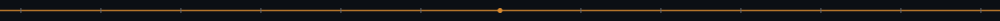

## Signals


## Product suite


## Services


## Domains


## Stack


## Build log


## Writing


## Working together

<table>
<tr>
<td width="33%" valign="top">

**Engagement**
Contract, fractional or advisory.
Remote, async-first, timezone
flexible. Scoped work with a
defined deliverable.

</td>
<td width="33%" valign="top">

**How I work**
Evals before code. Ship a
prototype early, harden it after.
Red team it before it reaches
production.

</td>
<td width="33%" valign="top">

**What you get**
Working system, eval harness,
security report, and documentation
that matches reality — not the
README from six months ago.

</td>
</tr>
</table>

<a href="mailto:ari@konkred.xyz">
  
</a>

 

**[konkred.xyz](https://konkred.xyz)** · **[ari@konkred.xyz](mailto:ari@konkred.xyz)** · **[Interactive profile](https://rearbitra.github.io/reARbitRA/)**

Concrete tools for abstract problems.

KONKRED — Factory Floor · Black #0A0908 · Red #D60019 · Ink #F4F1EB

