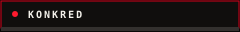
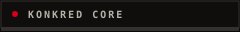
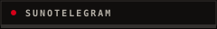
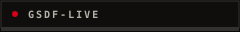
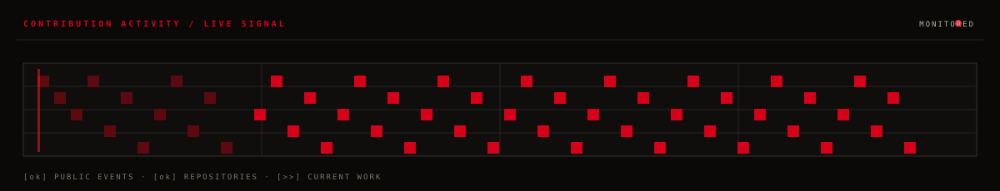

<!-- Profile panel source: generated SVGs in assets/ are deliberately self-contained because GitHub README images do not run JavaScript or fetch webfonts. -->

LIVE GRAPH · [OPEN PROFILE](https://github.com/reARbitRA) · [VIEW REPOSITORIES](https://github.com/reARbitRA?tab=repositories)
